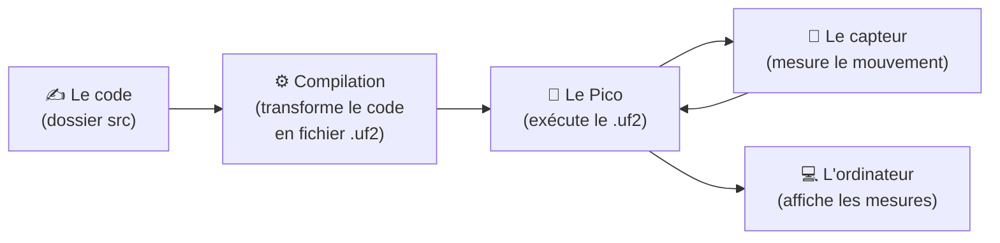
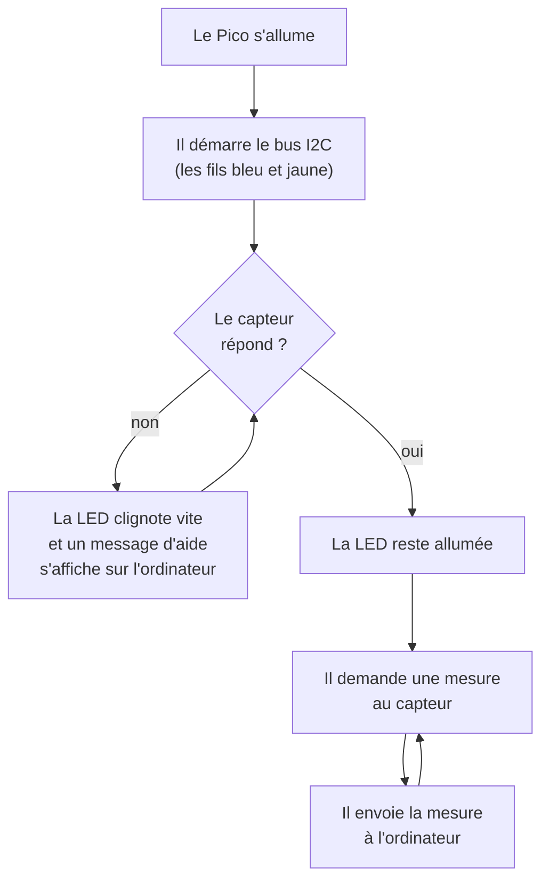
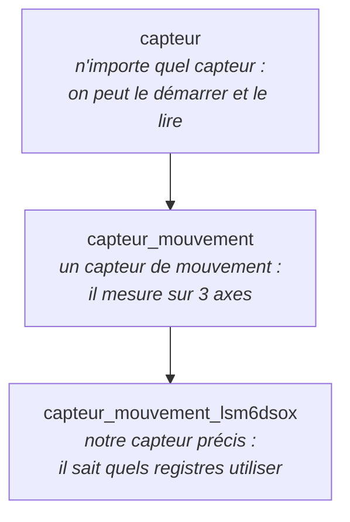
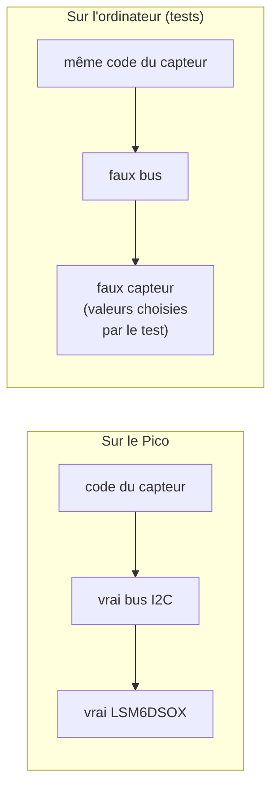

# Comment est organisé le projet

## En une phrase

Le Pico lit le capteur de mouvement **100 fois par seconde** et envoie les valeurs à
l'ordinateur par le câble USB.

---

## 1. Le chemin, du code jusqu'aux mesures



1. On écrit le code dans le dossier `src`.
2. La **compilation** le traduit en un fichier `.uf2` que le Pico comprend.
3. On envoie ce fichier sur le Pico.
4. Le Pico interroge le capteur sans arrêt et transmet les valeurs à l'ordinateur.

```
ton code (.c)  →  compilation  →  fichier .uf2  →  Pico
   toi tu lis       traduction      le Pico lit
```

> **Compiler** = traduire ton code (du texte) en langage machine (des nombres que le
> processeur lit). Le **`.uf2`** = ce langage machine, prêt à être glissé sur le Pico.

---

## 2. Les dossiers

| Dossier | À quoi il sert |
|---|---|
| `src/` | **Le code du Pico.** C'est le cœur du projet. |
| `tests/` | Petits programmes qui **vérifient** que le code fait ce qu'il faut, sans avoir besoin de la carte. |
| `outils/` | Scripts pour l'ordinateur : enregistrer les mesures, lancer les vérifications. |
| `build/` | Fichiers fabriqués par la compilation (dont les `.uf2`). On n'y touche pas. |

Dans `src/`, le code est rangé **par rôle**, un dossier par rôle :

| Dossier | Son rôle | Image |
|---|---|---|
| `bus/` | Faire circuler les messages entre le Pico et le capteur (par les fils bleu et jaune) | Le **téléphone** |
| `capteur/` | Savoir parler au capteur LSM6DSOX : le démarrer, lui demander ses mesures | Le **traducteur** |
| `communication/` | Envoyer les mesures à l'ordinateur, une ligne par mesure | Le **facteur** |
| `signalisation/` | Allumer ou faire clignoter la LED du Pico | Le **voyant** |
| `acquisition/` | Répéter sans fin : demander une mesure, l'envoyer, gérer les problèmes | Le **chef d'orchestre** |
| `programmes/` | Les deux programmes qu'on peut mettre sur le Pico | Le **bouton « marche »** |

Les deux programmes :
- **`prise_en_main`** : fait juste clignoter la LED (c'était l'étape 2, pour tester la carte).
- **`mesure_capteur`** : le vrai programme, qui lit le capteur et envoie les mesures.

---

## 3. Ce que fait le Pico quand il démarre (`mesure_capteur`)



Si le capteur arrête de répondre en cours de route (fil qui bouge, par exemple), le Pico
s'en rend compte, affiche `# erreur I2C`, puis **réessaie tout seul**. Il ne se bloque jamais.

Ce qui s'affiche sur l'ordinateur :
```
timestamp_ms,ax_g,ay_g,az_g,mag_g
12345,0.00317,-0.02178,1.00223,1.00247
```
- `timestamp_ms` : l'heure de la mesure (en millisecondes depuis l'allumage) ;
- `ax_g`, `ay_g`, `az_g` : l'accélération sur chaque axe, en g ;
- `mag_g` : l'accélération totale. Posé sur la table, le capteur indique **environ 1 g** :
  c'est la gravité.

---

## 4. Les « familles » de code

Certains morceaux de code sont des versions **plus précises** d'autres morceaux, comme des
poupées russes :



Un `capteur_mouvement_lsm6dsox` **est** un `capteur_mouvement`, qui **est** un `capteur`.
Le nom de chaque enfant reprend celui du parent : on voit tout de suite d'où il vient.

**Pourquoi c'est utile** : le chef d'orchestre (`acquisition`) dit simplement « capteur,
donne-moi une mesure ». Si un jour on change de capteur, on écrit une nouvelle poupée
`capteur_mouvement_autre`, et le reste du code ne change pas.

Même idée pour l'envoi des mesures :
`communication_moniteur` (savoir quand l'ordinateur écoute) → `communication_moniteur_csv`
(envoyer les mesures en lignes CSV).

---

## 5. Les tests

Un test est un petit programme qui vérifie un morceau du code **sur l'ordinateur**, sans le
Pico. Par exemple : « si le capteur renvoie ces octets-là, est-ce qu'on obtient bien 1 g ? ».

Comme il n'y a pas de vrai capteur sur l'ordinateur, on utilise un **faux capteur**
(dossier `tests/mocks/`) : un tableau de valeurs qu'on remplit à la main. Le code ne voit pas
la différence.



**Vérification automatique** : à chaque modification du code, le script `outils/tests.sh` se lance
tout seul. Il :
1. vérifie que le code se compile ;
2. lance tous les tests ;
3. signale les fonctions trop longues (plus de 30 lignes).

Si quelque chose casse, on le sait tout de suite.

---

## 6. Les règles du projet

| Règle | Pourquoi |
|---|---|
| Un fichier = un seul « objet » (le capteur, la LED, le bus…) | On sait où chercher |
| Une fonction = 30 lignes maximum | Chaque fonction reste courte et lisible |
| Un dossier par rôle | Le projet reste rangé quand il grandit |
| Le nom de l'enfant commence par celui du parent | On voit la famille d'un coup d'œil |

---

## 7. Ce que tu fais au quotidien

| Je veux… | Je fais… |
|---|---|
| Compiler | Dans le terminal : `cmake --build build` (ou automatique via `./outils/tests.sh`) |
| Mettre le programme sur le Pico | Dans le terminal : `picotool load -f -x build/mesure_capteur.uf2` |
| Voir les mesures | Serial Monitor de VS Code, port `usbmodem…`, 115200 bauds |
| Enregistrer des mesures pour le test des perturbations du robot | `python3 outils/test_perturbations.py capture d050_on_r1 --duree 30` |
| Analyser les mesures | `python3 outils/test_perturbations.py analyse` |
| Vérifier que tout marche | `./outils/tests.sh </dev/null` |

---

## 8. Petit lexique

| Mot | Sens |
|---|---|
| **Compiler** | Traduire ton code (texte que toi tu lis) en langage machine (nombres que le Pico lit) |
| **Langage machine** | Le seul langage que le processeur comprend : une suite de nombres = instructions très simples |
| **`.uf2`** | Le langage machine mis dans un format qu'on peut glisser sur le Pico, comme sur une clé USB |
| **`.elf`** | Le même programme + des infos pour chercher les bugs. On ne l'envoie pas sur le Pico |
| **BOOTSEL** | Bouton qui fait apparaître le Pico comme une clé USB, pour y déposer un `.uf2` |
| **Flash** | Mémoire du Pico qui garde le programme même débranché |
| **Bauds** | Vitesse du port série (115200). Doit être la même des deux côtés |
| **I2C** | Façon de discuter à deux fils : bleu (SDA, les données) et jaune (SCL, le rythme) |
| **Registre** | Petite case mémoire du capteur. On y écrit des réglages, on y lit les mesures |
| **WHO_AM_I** | Registre qui contient toujours `0x6C` : sert à vérifier que c'est bien notre capteur |
| **CSV** | Texte en colonnes séparées par des virgules, lisible par Excel ou Python |
| **g** | Unité d'accélération : 1 g = la gravité terrestre |
| **Test** | Petit programme qui vérifie automatiquement un morceau du code |
| **Faux capteur (mock)** | Imitation du capteur, utilisée par les tests à la place du vrai |
