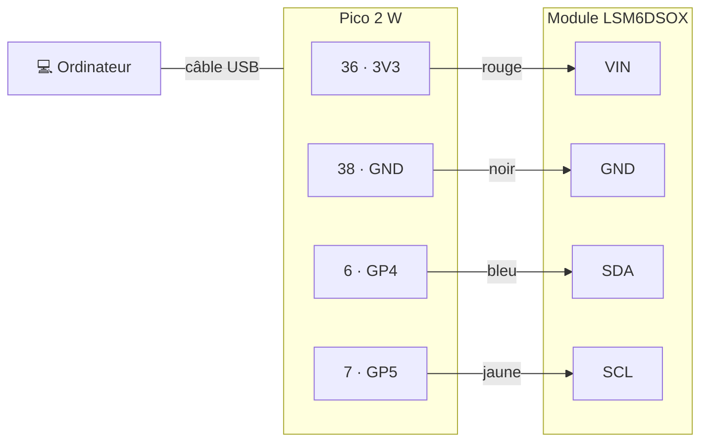
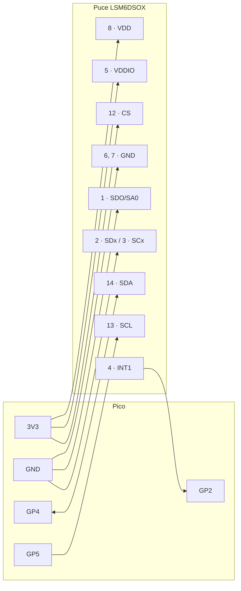

# Branchements

| Partie | Quand | Capteur utilisé |
|---|---|---|
| **A. Test sur le robot** | Maintenant | Module **Adafruit LSM6DSOX** (petite carte noire, composants déjà intégrés) |
| **B. Carte finale** | Plus tard | **Puce LSM6DSOX seule**, soudée sur notre propre circuit |

---

## A. Test sur le robot UR3 (module Adafruit)

### A.1 Matériel

| Élément | Rôle |
|---|---|
| Raspberry Pi Pico 2 W | Lit le capteur et envoie les mesures |
| Module Adafruit LSM6DSOX (header **soudé**) | Mesure l'accélération |
| 4 fils (rouge, noir, bleu, jaune) | Relient le capteur au Pico |
| Câble micro-USB | Alimente le Pico et transporte les mesures |
| Ordinateur avec `outils/test_perturbations.py` | Enregistre les mesures |
| Entretoises **non métalliques** (PLA, bois) | Fixent le capteur à une distance précise du moteur |
| Bras robotisé UR3 | Source de perturbation testée |

### A.2 Câblage

| Module (inscription) | Pico (broche) | Fil | Rôle |
|---|---|---|---|
| **VIN** | **3V3** (36) | rouge | Alimentation 3,3 V |
| **GND** | **GND** (38) | noir | Masse commune |
| **SDA** | **GP4** (6) | bleu | Données I2C |
| **SCL** | **GP5** (7) | jaune | Horloge I2C |
| 3Vo, SDO, CS, I1, I2, SDX, SCX | — | — | **Ne rien brancher** |

- Adresse I2C : **0x6A**, réglée par défaut sur le module.
- Résistances de tirage et condensateurs : **déjà sur le module**, rien à ajouter.
- 3V3/GND et GP4/GP5 sont sur **deux rangées opposées** du Pico.

### A.3 Vérifications avant de mettre sous tension

| ✔ | Point à vérifier |
|---|---|
| ☐ | USB débranché pendant le câblage |
| ☐ | **Pas de breadboard** : sinon, jamais deux fils dans la même ligne de 5 trous (ils sont reliés → court-circuit) |
| ☐ | Rouge sur la broche **36**, pas sur 37, 39 ou 40 |
| ☐ | Pas de court-circuit entre 3V3 et GND (multimètre, mode continuité) |
| ☐ | Bleu et jaune sur **SDA/SCL** du module, pas sur SDX/SCX |
| ☐ | Après branchement : LED du Pico **fixe** (clignotement rapide = capteur non trouvé) |
| ☐ | Si le Pico **chauffe** : débrancher l'USB immédiatement (court-circuit) |

### A.4 Installation sur le robot

| Consigne | Pourquoi |
|---|---|
| Capteur fixé sur entretoises non métalliques | Le métal pourrait modifier les perturbations mesurées |
| Distance mesurée du **centre du capteur** au **carter du moteur** | Même repère pour toutes les mesures |
| Câble USB attaché le long du bras, **même trajet à chaque essai** | Le câble capte lui aussi les perturbations |
| Même position du robot pour tous les essais | Seule la distance doit changer |
| Arrêt d'urgence à portée de main, personne dans la zone du robot | Sécurité |

### A.5 Déroulé d'une mesure

| Étape | Robot | Commande |
|---|---|---|
| 1 | **Hors tension** (freins serrés) | `python3 outils/test_perturbations.py capture d050_off_r1 --duree 30` |
| 2 | **Sous tension**, position maintenue | `python3 outils/test_perturbations.py capture d050_on_r1 --duree 30` |
| 3 | Répéter 3 fois, puis changer de distance (0, 10, 20, 30, 50, 75, 100, 150 mm) | |
| 4 | Fin des mesures | `python3 outils/test_perturbations.py analyse` |

`d050` = distance en mm, `off`/`on` = robot éteint/allumé, `r1` = répétition n°1.
Fermer le Serial Monitor de VS Code avant de lancer `test_perturbations.py`.

---

## B. Carte finale (puce LSM6DSOX seule)

Sur notre propre circuit, il faut **ajouter nous-mêmes** ce que le module Adafruit contenait.

### B.1 Branchement de la puce

Numéros de broches de la puce LSM6DSOX (boîtier LGA-14, datasheet ST).

| Broche puce | Nom | Relier à | Rôle |
|---|---|---|---|
| 8 | **VDD** | 3V3 | Alimentation du capteur |
| 5 | **VDDIO** | 3V3 | Alimentation des entrées/sorties |
| 6, 7 | **GND** | GND | Masse |
| 14 | **SDA** | GP4 | Données I2C |
| 13 | **SCL** | GP5 | Horloge I2C |
| 12 | **CS** | **3V3** | ⚠️ **Obligatoire** : à 3V3 = mode I2C (à 0 V, la puce passe en SPI) |
| 1 | **SDO/SA0** | GND | Fixe l'adresse I2C à **0x6A** |
| 2, 3 | **SDx, SCx** | GND | Bus auxiliaire non utilisé |
| 4 | **INT1** | GP2 | Réveil du Pico (mise en veille, plus tard) |
| 9 | INT2 | — | Non connecté |
| 10, 11 | OCS_Aux, SDO_Aux | — | Non connectés |

> CS n'apparaît pas dans le tableau de départ du projet : sans lui, la puce risque de ne
> pas répondre en I2C.

### B.2 Composants à ajouter

| Composant | Valeur | Entre | Utilité |
|---|---|---|---|
| **C1** | 100 nF | VDD (8) et GND | Filtre les parasites de l'alimentation du capteur |
| **C2** | 100 nF | VDDIO (5) et GND | Filtre les parasites de l'alimentation des entrées/sorties |
| **R_pu1** | 10 kΩ (ou 4,7 kΩ) | SDA (14) et 3V3 | Ramène SDA à 1 au repos |
| **R_pu2** | 10 kΩ (ou 4,7 kΩ) | SCL (13) et 3V3 | Ramène SCL à 1 au repos |

| Règle de placement | Pourquoi |
|---|---|
| Condensateurs **au plus près** des broches 8 et 5 | Plus ils sont loin, moins ils filtrent |
| Une seule paire de résistances de tirage sur tout le bus I2C | Avec plusieurs modules (RTC…), elles s'additionnent |
| 4,7 kΩ si les pistes I2C sont longues | Fronts plus nets à 400 kHz |

### B.3 Autres modules de la carte finale

| Module | Branchement |
|---|---|
| Horloge RTC | *à compléter* (probablement sur le même bus I2C : GP4/GP5) |
| Carte SD | *à compléter* (bus SPI) |
| Moteur vibrant (alerte) | *à compléter* |
| Batterie / alimentation | *à compléter* |

---

## Résumé : module ou puce seule ?

| | A. Module Adafruit (test) | B. Puce seule (finale) |
|---|---|---|
| Fils à brancher | 4 | 9 broches à relier |
| Condensateurs | Déjà sur le module | **À ajouter** (C1, C2) |
| Résistances de tirage | Déjà sur le module | **À ajouter** (R_pu1, R_pu2) |
| Adresse 0x6A | Déjà réglée | SDO/SA0 à relier à GND |
| Mode I2C | Déjà réglé | CS à relier à 3V3 |
| Code du Pico | Identique | Identique |
