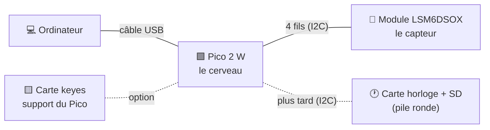

# Matériel du projet

## 1. Vue d'ensemble

---

## 2. Liste du matériel

| Matériel | C'est quoi | Sert à | Utilisé |
|---|---|---|---|
| **Raspberry Pi Pico 2 W** | Petit ordinateur sur une carte (puce RP2350 + Wi-Fi) | Lire le capteur, envoyer les mesures | ✅ Maintenant |
| **Module LSM6DSOX** (Adafruit) | Petite carte noire qui porte le capteur et ses composants | Mesurer l'accélération | ✅ Maintenant |
| **Barrette de broches** (header) | Rangée de broches métalliques | À **souder** sur le module pour y brancher des fils | ✅ Maintenant |
| **Fils de connexion** (Dupont) | Fils avec embouts femelles/mâles | Relier le module au Pico | ✅ Maintenant |
| **Câble micro-USB** | Câble entre le Pico et l'ordinateur | Alimenter le Pico + transporter les mesures | ✅ Maintenant |
| **Plaque d'essai** (breadboard) | Plaque à trous reliés entre eux | Faire des montages sans souder | ✅ Maintenant |
| **Carte avec pile ronde** | **PiCowbell Adalogger** (Adafruit) : horloge RTC + lecteur de carte micro-SD, pile CR1220 | Donner l'heure réelle, enregistrer sur carte SD | ⬜ Plus tard |
| **Carte keyes** (noire et jaune) | Carte d'extension : on y enfiche le Pico, chaque broche est sortie sur un connecteur | Brancher proprement sans plaque d'essai | ⬜ Option |
| **Câbles STEMMA QT** (4 couleurs) | Câbles à petits connecteurs blancs | Relier deux modules Adafruit entre eux | ⬜ Plus tard (pas compatibles avec le Pico) |

---

## 3. Détail des éléments principaux

### Pico 2 W
| Point | Détail |
|---|---|
| Puce | RP2350 (2 processeurs) |
| LED intégrée | Commandée par la puce Wi-Fi (pas par la broche GP25 comme sur un Pico simple) |
| Broches utilisées | 36 (3V3), 38 (GND), 6 (GP4 = SDA), 7 (GP5 = SCL) |
| Bouton BOOTSEL | Fait apparaître le Pico comme une clé USB pour y déposer un `.uf2` |

### Module LSM6DSOX (Adafruit)

| Partie du module | Rôle |
|---|---|
| **Carré noir au centre** | La vraie puce LSM6DSOX (accéléromètre + gyroscope, 2,5 × 3 mm) |
| Petits composants autour | Régulateur de tension, adaptation des signaux, condensateurs, résistances : déjà intégrés |
| LED « on » | S'allume quand le module est alimenté |
| 2 connecteurs blancs | Connecteurs STEMMA QT (pour câbles Adafruit) |
| Rangée du bas : VIN, 3Vo, GND, SCL, SDA, DO, CS, I1, I2 | **Celle qu'on utilise** (VIN, GND, SCL, SDA) |
| Rangée du haut : SCX, SDX, CS, DO, GND | Bus auxiliaire pour un autre capteur : **non utilisée** |
| Flèches X, Y, Z | Sens des 3 axes de mesure |

> ⚠️ Le header doit être **soudé** sur le module. Simplement enfiché, le contact est
> mauvais et le capteur décroche au bout de quelques secondes.

### Câbles STEMMA QT
| Point | Détail |
|---|---|
| Couleurs | noir = GND, rouge = 3,3 V, bleu = SDA, jaune = SCL |
| Problème | Nos câbles ont un connecteur blanc **aux deux bouts** : ils ne se branchent pas sur le Pico |
| Solution actuelle | Souder le header du module et utiliser des fils Dupont |
| Alternative (à acheter) | Câble « STEMMA QT vers broches mâles » (Adafruit réf. 4209) : se clipse dans le module, se pique sur le Pico, sans soudure |
| Usage plus tard | Relier le module LSM6DSOX à la carte horloge (si elle a un connecteur blanc) |

---

## 4. Quel matériel pour quelle phase

| Phase | Matériel |
|---|---|
| **Test du capteur / test des perturbations sur le robot** | Pico 2 W · module LSM6DSOX (header soudé) · 4 fils · câble USB · ordinateur |
| **Boîtier : horloge et enregistrement** | + carte horloge/SD · carte micro-SD |
| **Carte finale** | Puce LSM6DSOX seule + composants (voir [BRANCHEMENTS.md](BRANCHEMENTS.md), partie B) |

---

## 5. Petit lexique

| Mot | Sens |
|---|---|
| **Module** | Petite carte qui porte une puce et tous ses composants, prête à brancher |
| **Header** | Barrette de broches à souder sur un module |
| **Dupont** | Fil de prototypage avec embout mâle ou femelle |
| **Breadboard** | Plaque d'essai : les trous d'une même ligne sont reliés entre eux |
| **STEMMA QT** | Connecteur blanc à 4 fils d'Adafruit, pour relier des modules I2C sans souder |
| **RTC** | Horloge temps réel : garde l'heure même éteinte, grâce à sa pile |
| **I2C** | Liaison à 2 fils (SDA = données, SCL = rythme) entre le Pico et les modules |
