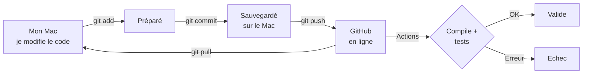

# Fiche GitHub

Dépôt : https://github.com/amnkd555/APP2028_CAPT (privé)

## Le principe

## Les mots

| Mot | Sens |
|---|---|
| **Git** | Logiciel qui garde l'historique de toutes les versions du code |
| **GitHub** | Site qui stocke ce code en ligne |
| **Dépôt** (repo) | Le dossier du projet suivi par Git |
| **Commit** | Une sauvegarde, avec un message qui dit ce qui a changé |
| **Push** | Envoyer ses commits sur GitHub |
| **Pull** | Récupérer depuis GitHub les changements faits ailleurs |
| **Branche** | Une version parallèle du code ; la principale s'appelle `main` |
| **Actions** | Vérification automatique faite par GitHub après chaque push |
| **`.github/`** | Dossier qui contient la recette de cette vérification |
| **`.gitignore`** | Liste des fichiers que Git ne doit pas envoyer (ex. `build/`) |
| **Jeton** (token) | Mot de passe spécial pour que le Mac accède à GitHub |

## Les commandes

| But | Commande |
|---|---|
| Voir ce qui a changé | `git status` |
| Sauvegarder et envoyer | `git add . && git commit -m "message" && git push` |
| Récupérer la dernière version | `git pull` |
| Voir l'historique | `git log --oneline` |
| Vérifier la connexion GitHub | `gh auth status` |

## Les fichiers ignorés

`build/`, `.cache/`, `mesures/`, `.DS_Store` : Git ne les envoie pas sur GitHub (fichiers générés ou lourds).
