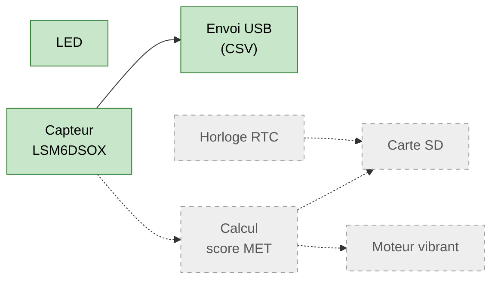
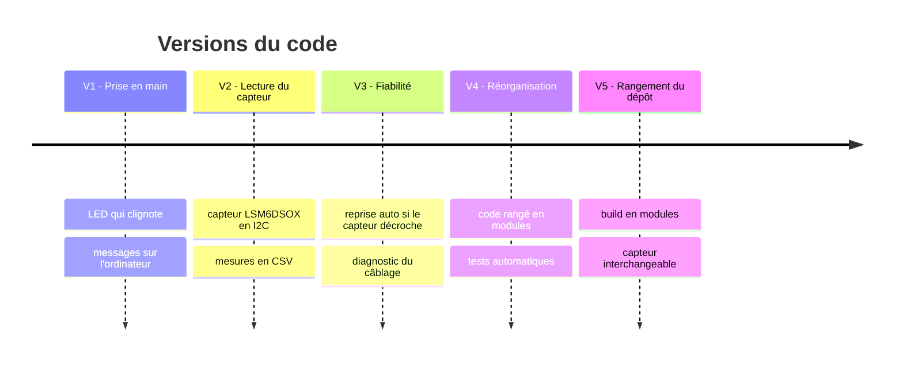
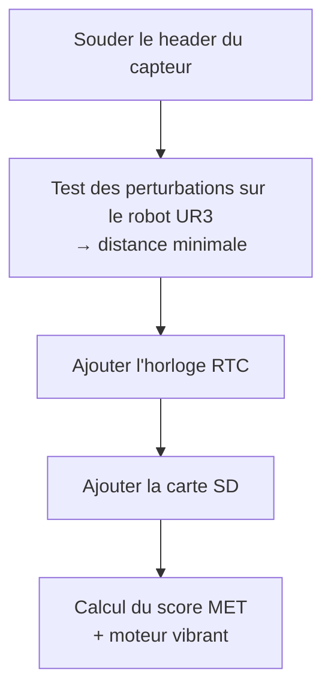

# Évolutions du code

Ce fichier suit **chaque version du code** qui fait fonctionner le capteur : ce qui a été
ajouté, ce qui a été corrigé, et pourquoi. Il est complété à chaque modification.

---

## 1. Où on en est



Vert = fonctionne, gris = à venir

| Module | Dossier | État |
|---|---|---|
| LED | `src/signalisation/` | fait |
| Bus I2C (fils bleu/jaune) | `src/bus/` | fait |
| Capteur LSM6DSOX | `src/capteur/` | validé sur la carte, header à souder avant le robot |
| Envoi des mesures à l'ordinateur | `src/communication/` | fait |
| Boucle de mesure | `src/acquisition/` | fait |
| Horloge RTC (date et heure réelles) | — | à venir |
| Carte SD (enregistrer sans ordinateur) | — | à venir |
| Moteur vibrant (alerter si trop sédentaire) | — | à venir |
| Calcul du score MET | — | à venir |

---

## 2. Historique des versions



### V1 — Prise en main · 2026-10-01
**But** : vérifier que le Pico marche.
**Ce que fait le code** : la LED clignote 1 fois par seconde, un message s'affiche chaque seconde.

| Problème | Correction |
|---|---|
| La LED ne clignotait pas | La carte est un **Pico 2 W** : sa LED passe par la puce Wi-Fi, pas par la broche GP25. Le code gère maintenant les deux cas. |
| Le message de démarrage n'apparaissait jamais | Il partait avant que l'ordinateur écoute. Il est maintenant **renvoyé à chaque ouverture** du moniteur. |

### V2 — Lecture du capteur · 2026-10-01
**But** : lire l'accéléromètre.
**Ce que fait le code** :
1. vérifie que c'est bien le bon capteur (il doit répondre `0x6C`) ;
2. le règle : 104 mesures/seconde, ±2 g ;
3. envoie chaque mesure à l'ordinateur : `heure, ax, ay, az, total`.

### V3 — Fiabilité · 2026-10-01
**But** : ne plus bloquer quand le capteur décroche.

| Problème | Correction |
|---|---|
| Après quelques secondes, **218 000 erreurs** en boucle | Après 10 erreurs d'affilée, le Pico **débloque le bus et redémarre le capteur** tout seul. |
| Impossible de savoir quel fil posait problème | Ajout d'un **diagnostic** : il teste si les fils bleu/jaune sont inversés et liste qui répond sur le bus. |
| Le diagnostic disait « fil relié » à tort | Ce test est faussé par un défaut connu de la puce (RP2350-E9) : **retiré**. |

**Cause réelle de la panne** : le header du capteur n'était pas soudé (contact intermittent).

### V4 — Réorganisation · 2026-10-01
**But** : un code rangé, facile à faire grandir.
**Ce qui change** : rien pour le Pico (même comportement). Le code est découpé en modules
(un dossier par rôle) et des **tests vérifient tout automatiquement** à chaque modification.
Détails dans [architecture.md](architecture.md).

**Vérifié sur la carte** : le capteur répond et la gravité change bien d'axe quand on le tourne.

| Position | ax | ay | az | total |
|---|---|---|---|---|
| À plat (un peu penché) | 0,07 | 0,21 | **0,95** | 0,98 |
| Tourné à 90° | −0,01 | **−1,05** | −0,09 | 1,05 |

Le total n'est pas exactement 1 g (0,98 et 1,05) : petit décalage d'usine de chaque axe,
sans effet sur le test des perturbations du robot. À corriger par étalonnage avant le calcul du score MET.

| Problème | Correction |
|---|---|
| Le Pico a chauffé, capteur éteint | Deux fils dans la même ligne de 5 trous de la breadboard → court-circuit. Un fil par ligne. |

### V5 — Rangement du dépôt · 2026-10-01
**But** : un dépôt propre, facile à reprendre.
**Ce qui change** : rien pour le Pico (même comportement, même taille de programme à 8 octets près).

| Avant | Après |
|---|---|
| Fichiers `.c` listés à la main, en double dans les 2 programmes | Une bibliothèque par dossier de `src/` (`src/CMakeLists.txt`) |
| `acquisition` ne marchait qu'avec le LSM6DSOX | Elle accepte n'importe quel capteur de mouvement |
| Tests dans `tests/`, scripts dans `outils/` | Tests dans `src/<dossier>/tests/`, scripts dans `scripts/` |
| Vérification écrite 2 fois (Mac et GitHub) | Un seul script, `scripts/verifier.sh`, utilisé par les deux |

---

## 3. Prochaines étapes



---

## Modèle pour une nouvelle version

```markdown
### Vx — Titre court · AAAA-MM-JJ
**But** : ce qu'on voulait obtenir.
**Ce que fait le code** : 1 à 3 phrases.

| Problème | Correction |
|---|---|
| ce qui n'allait pas | ce qu'on a changé et pourquoi |
```
Penser aussi à mettre à jour le tableau et le schéma de la partie 1.
