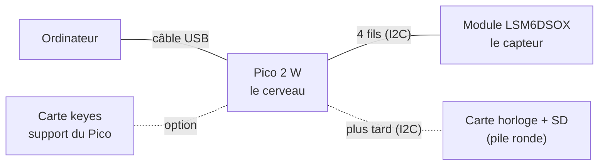

# Matériel du projet

## 1. Vue d'ensemble

---

## 2. Matériel de montage

Composants principaux (Pico 2 W, LSM6DSOX, PiCowbell Adalogger, pile CR1220, câbles STEMMA QT, câble USB, alimentation) : [dossier-technique.md, §3](../conception/dossier-technique.md).

| Matériel | C'est quoi | Sert à | Utilisé |
|---|---|---|---|
| **Barrette de broches** (header) | Rangée de broches métalliques | À **souder** sur le module pour y brancher des fils | Maintenant |
| **Fils de connexion** (Dupont) | Fils avec embouts femelles/mâles | Relier le module au Pico | Maintenant |
| **Plaque d'essai** (breadboard) | Plaque à trous reliés entre eux | Faire des montages sans souder | Maintenant |
| **Carte keyes** (noire et jaune) | Carte d'extension : on y enfiche le Pico, chaque broche est sortie sur un connecteur | Brancher proprement sans plaque d'essai | Option |

---

## 3. Détail des éléments principaux

### Pico 2 W
| Point | Détail |
|---|---|
| LED intégrée | Commandée par la puce Wi-Fi (pas par la broche GP25 comme sur un Pico simple) |
| Bouton BOOTSEL | Fait apparaître le Pico comme une clé USB pour y déposer un `.uf2` |

### Module LSM6DSOX (Adafruit)

| Partie du module | Rôle |
|---|---|
| **Carré noir au centre** | La vraie puce LSM6DSOX (accéléromètre + gyroscope, 2,5 × 3 mm) |
| LED « on » | S'allume quand le module est alimenté |
| 2 connecteurs blancs | Connecteurs STEMMA QT (pour câbles Adafruit) |
| Rangée du bas : VIN, 3Vo, GND, SCL, SDA, DO, CS, I1, I2 | **Celle qu'on utilise** (VIN, GND, SCL, SDA) |
| Flèches X, Y, Z | Sens des 3 axes de mesure |

### Câbles STEMMA QT
| Point | Détail |
|---|---|
| Couleurs | noir = GND, rouge = 3,3 V, bleu = SDA, jaune = SCL |
| Solution actuelle | Souder le header du module et utiliser des fils Dupont |
| Alternative (à acheter) | Câble « STEMMA QT vers broches mâles » (Adafruit réf. 4209) : se clipse dans le module, se pique sur le Pico, sans soudure |

---

## 4. Quel matériel pour quelle phase

| Phase | Matériel |
|---|---|
| **Test du capteur / test des perturbations sur le robot** | Pico 2 W · module LSM6DSOX (header soudé) · 4 fils · câble USB · ordinateur |
| **Boîtier : horloge et enregistrement** | + carte horloge/SD · carte micro-SD |
| **Carte finale** | Puce LSM6DSOX seule + composants (voir [dossier-technique.md, §4.2](../conception/dossier-technique.md)) |

Vocabulaire : [index](../index.md).
